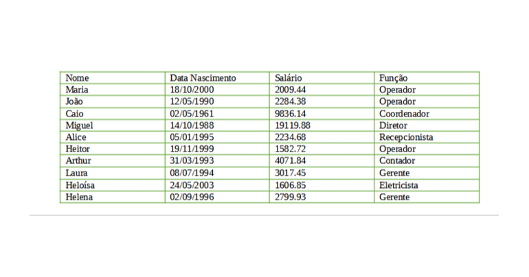

# Teste Prático - Iniflex

## Descrição do desafio

Este repositório contém a resolução de um desafio técnico de programação em Java.

O objetivo é modelar pessoas e funcionários de uma indústria e, a partir de uma lista inicial, executar operações de manipulação, agrupamento, ordenação e exibição de dados.

## Tabela base de funcionários

## Requisitos propostos

1. Criar a classe `Pessoa` com os atributos:

- nome (`String`)
- dataNascimento (`LocalDate`)

2. Criar a classe `Funcionario` herdando de `Pessoa`, com os atributos:

- salario (`BigDecimal`)
- funcao (`String`)

3. Implementar uma classe principal para executar as ações:

- Inserir todos os funcionários na mesma ordem da tabela.
- Remover o funcionário "João" da lista.
- Imprimir todos os funcionários com:
  - data no formato `dd/MM/yyyy`;
  - salário com separador de milhar por ponto e decimal por vírgula.
- Aplicar aumento de 10% no salário de todos os funcionários.
- Agrupar funcionários por função em um `Map<String, List<Funcionario>>`.
- Imprimir os funcionários agrupados por função.
- Imprimir funcionários que fazem aniversário nos meses 10 e 12.
- Imprimir o funcionário com maior idade (nome e idade).
- Imprimir a lista de funcionários em ordem alfabética.
- Imprimir o total dos salários dos funcionários.
- Imprimir quantos salários mínimos cada funcionário recebe, considerando salário mínimo de R$ 1212.00.
